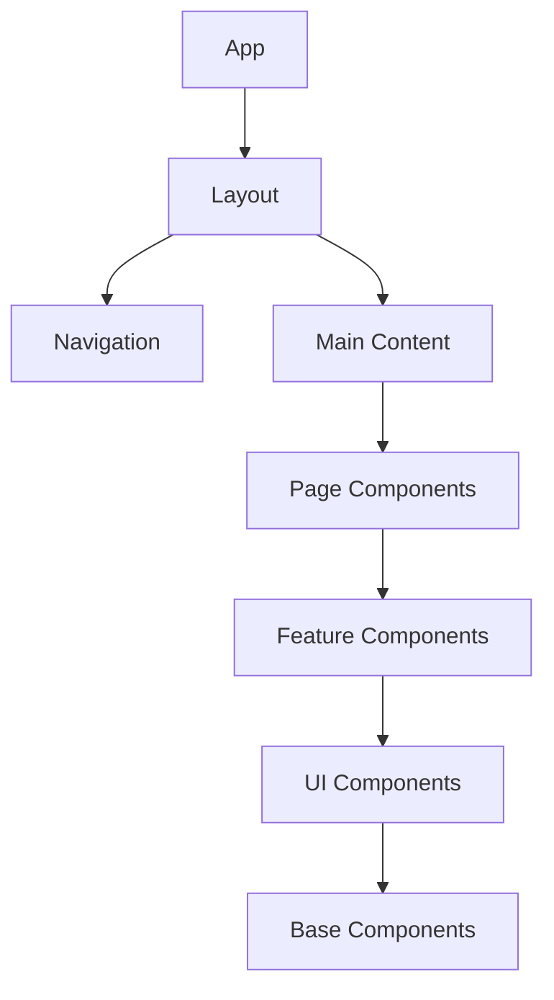
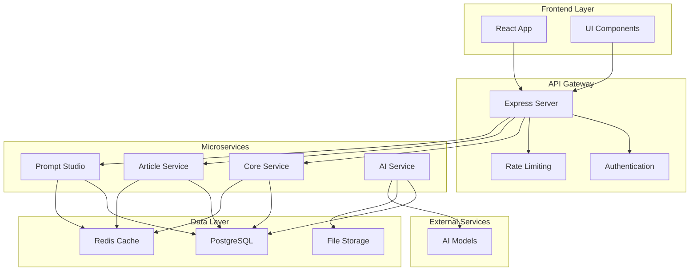
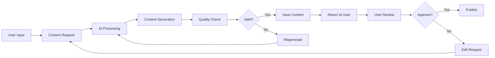
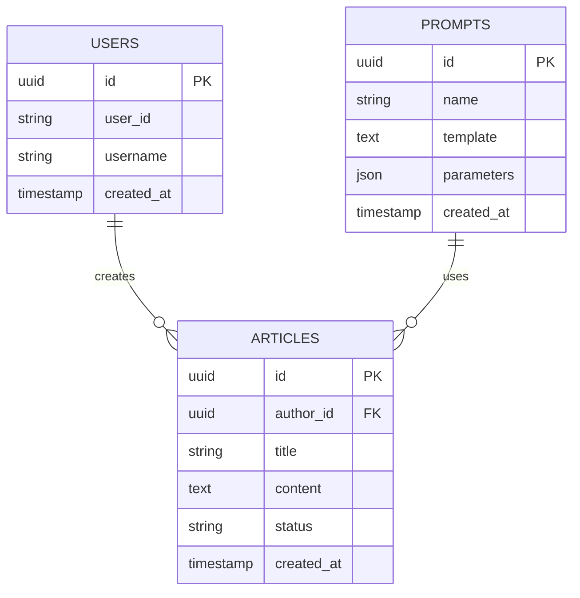
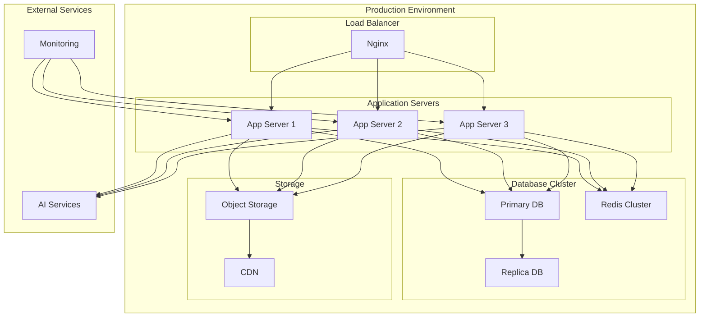

# Architecture Diagrams

This page demonstrates how to use Mermaid diagrams in Base Library documentation.

## Application Structure

## Backend Architecture

## Content Generation Workflow

## Database Schema

## Deployment Architecture

