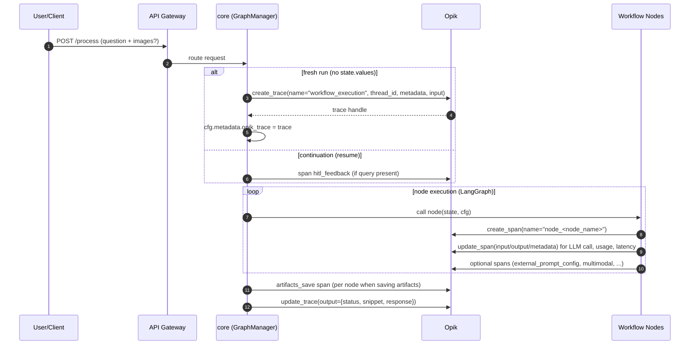
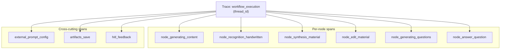
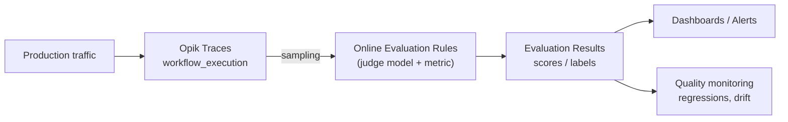
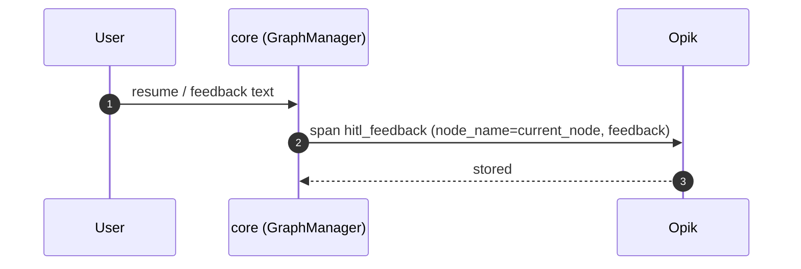

# Opik — integration architecture diagrams

This document contains Mermaid diagrams showing **how Opik is integrated** into Base Library: where traces/spans are created, what data is sent, and how it can be used for Online Evaluation.

## 1) Opik in the overall architecture

```mermaid
graph TB
  subgraph "Client Layer"
    WEB[Web Frontend]
    API_CLIENT[API Client]
  end

  subgraph "API Gateway"
    NGINX[Nginx/Load Balancer]
  end

  subgraph "Core Services"
    CORE["core service<br/>(LangGraph)"]
    ARTICLE[article service]
    PROMPT[Prompt Config service]
  end

  subgraph "Data Layer"
    PG[(PostgreSQL)]
    REDIS[(Redis)]
    FS[File Storage]
  end

  subgraph "External / Observability"
    OPIK[Opik (Comet)<br/>Traces / Spans / Evaluation]
    LLM[LLM Providers<br/>OpenAI / DeepSeek / ...]
  end

  WEB --> NGINX --> CORE
  API_CLIENT --> NGINX --> CORE

  CORE --> PROMPT
  CORE --> ARTICLE
  CORE --> PG
  ARTICLE --> PG
  ARTICLE --> FS
  PROMPT --> PG
  PROMPT --> REDIS

  CORE --> LLM
  CORE --> OPIK
```

## 2) Trace lifecycle: `workflow_execution`



## 3) Span map: what is logged where



## 4) Online Evaluation: turning traces into metrics



## 5) HITL: user feedback as part of the trace



