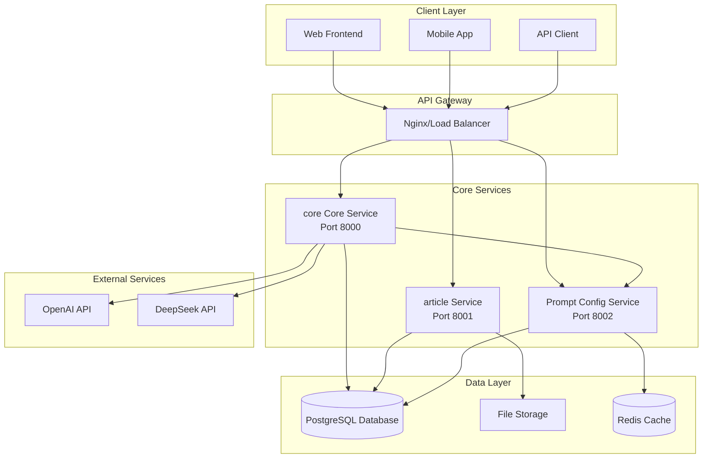

# Architecture Overview

The Base Library Backend is built on a microservices architecture designed for scalability, maintainability, and educational content generation. This document provides a comprehensive overview of the system architecture and its components.

## System Architecture

## Core Components

### 1. core Core Service

The main orchestration service that handles the educational content generation workflow.

**Responsibilities:**
- Content generation using LangGraph workflows
- Image recognition and OCR processing
- Human-in-the-Loop (HITL) interactions
- Security validation and prompt injection protection
- State management and checkpointing

**Technology Stack:**
- FastAPI for REST API
- LangGraph for workflow orchestration
- PostgreSQL for state persistence
- OpenAI/DeepSeek for AI capabilities

### 2. article Service

Manages the storage, organization, and export of generated educational materials.

**Responsibilities:**
- Material storage and retrieval
- PDF and Markdown export functionality
- File management and organization
- Content versioning and metadata management

**Technology Stack:**
- FastAPI for REST API
- PostgreSQL for metadata storage
- File system for content storage
- WeasyPrint for PDF generation

### 3. Prompt Config Service

Provides dynamic prompt generation and personalization capabilities.

**Responsibilities:**
- User profile management
- Context-aware prompt generation
- Template management and caching
- Prompt optimization and A/B testing

**Technology Stack:**
- FastAPI for REST API
- PostgreSQL for configuration storage
- Redis for caching
- YAML for template configuration

## Data Flow

### Content Generation Workflow

1. **Input Processing**: User request validation and security checks
2. **Content Generation**: AI-powered material creation
3. **Image Recognition**: OCR processing of uploaded images (optional)
4. **Material Synthesis**: Combining generated content with recognized text
5. **Interactive Editing**: Human-in-the-Loop refinement process
6. **Question Generation**: Creating assessment questions
7. **Answer Generation**: Providing detailed answers to questions
8. **Storage**: Saving materials to the article Service

## Security Architecture

### Multi-Layer Security

1. **Input Validation**: Comprehensive validation of all user inputs
2. **Prompt Injection Protection**: AI-based detection and filtering
3. **Rate Limiting**: Protection against abuse and DoS attacks
4. **CORS Configuration**: Controlled cross-origin resource sharing

### SecurityGuard System

The platform includes a sophisticated security system that:
- Detects prompt injection attempts using LLM-based analysis
- Implements fuzzy content cleaning algorithms
- Provides educational context awareness
- Operates with graceful degradation (non-blocking)

## Scalability Considerations

### Horizontal Scaling

- **Stateless Services**: All services are designed to be stateless
- **Database Sharding**: PostgreSQL can be sharded by user or content type
- **Load Balancing**: Nginx can distribute traffic across multiple instances
- **Caching Strategy**: Redis provides distributed caching capabilities

### Performance Optimization

- **Async Processing**: All I/O operations are asynchronous
- **Connection Pooling**: Database connections are pooled for efficiency
- **Content Caching**: Frequently accessed content is cached
- **CDN Integration**: Static assets can be served via CDN

## Technology Stack

### Backend Services
- **Python 3.11+**: Primary programming language
- **FastAPI**: Modern, fast web framework
- **LangGraph**: Workflow orchestration
- **SQLAlchemy**: Database ORM
- **Alembic**: Database migrations

### Database & Storage
- **PostgreSQL 16**: Primary database
- **Redis**: Caching and session storage
- **File System**: Local file storage

### AI & ML
- **OpenAI GPT-4**: Primary language model
- **DeepSeek**: Cost-effective alternative
- **Vision APIs**: Image recognition capabilities
- **LangFuse**: Observability and monitoring

### Infrastructure
- **Docker**: Containerization
- **Docker Compose**: Local development
- **Nginx**: Reverse proxy and load balancing
- **Prometheus**: Metrics collection
- **Grafana**: Monitoring dashboards

## Deployment Architecture

### Development Environment
- Single-machine Docker Compose setup
- Local PostgreSQL and Redis instances
- Mock external services for testing

### Production Environment
- Kubernetes or Docker Swarm orchestration
- Managed PostgreSQL and Redis services
- Load balancers and auto-scaling groups
- Monitoring and logging infrastructure

## Monitoring & Observability

### Metrics Collection
- **Application Metrics**: Request rates, response times, error rates
- **Business Metrics**: Content generation success rates, user engagement
- **Infrastructure Metrics**: CPU, memory, disk usage
- **AI Metrics**: Token usage, model performance, cost tracking

### Logging Strategy
- **Structured Logging**: JSON-formatted logs for easy parsing
- **Log Aggregation**: Centralized logging with ELK stack
- **Error Tracking**: Automated error detection and alerting
- **Audit Trails**: Complete audit logs for security compliance

## Next Steps

- [Services Architecture](./services.md) - Detailed service breakdown
- [Workflow Architecture](./workflow.md) - Content generation workflow
- [Security Architecture](./security.md) - Security implementation details
- [Opik Integration](./opik.md) - Observability, tracing, and online evaluation
