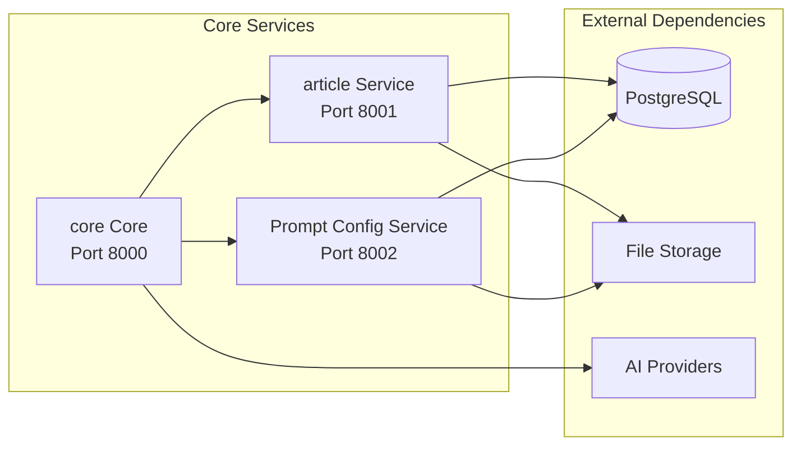

# Services Architecture

This document provides a detailed breakdown of each service in the Base Library Backend architecture, their responsibilities, and how they interact with each other.

## Service Overview

The platform consists of three core services, each with specific responsibilities and well-defined interfaces:



## core Core Service

**Port**: 8000  
**Primary Role**: Content generation orchestration and workflow management

### Responsibilities

- **Workflow Orchestration**: Manages the LangGraph-based content generation pipeline
- **AI Integration**: Interfaces with multiple AI providers (OpenAI, DeepSeek)
- **Image Processing**: Handles OCR and image recognition tasks
- **Security Validation**: Implements SecurityGuard for prompt injection protection
- **State Management**: Maintains workflow state and checkpoints
- **HITL Coordination**: Manages Human-in-the-Loop interactions

### Key Components

#### API Endpoints
- `POST /process` - Main content generation endpoint
- `POST /upload-images/{thread_id}` - Image upload for OCR processing
- `GET /state/{thread_id}` - Retrieve workflow state
- `DELETE /thread/{thread_id}` - Clean up thread resources
- `GET /api/hitl/{thread_id}` - HITL configuration management

#### Workflow Nodes
1. **Input Processing** - Validates and processes user requests
2. **Content Generation** - Creates educational materials using AI
3. **Recognition** - Processes uploaded images for text extraction
4. **Synthesis** - Combines generated content with recognized text
5. **Edit Material** - Interactive content refinement (HITL)
6. **Question Generation** - Creates assessment questions (HITL)
7. **Answer Generation** - Provides detailed answers

#### Technology Stack
- **FastAPI**: REST API framework
- **LangGraph**: Workflow orchestration
- **SQLAlchemy**: Database ORM
- **OpenAI/DeepSeek**: AI model integration
- **Pillow**: Image processing

### Configuration

```yaml
# configs/graph.yaml
models:
  default:
    provider: deepseek
    model_name: "deepseek-chat"
    temperature: 0.1
    max_tokens: 4000
  
  vision:
    provider: openai
    model_name: "gpt-4o-mini"
    temperature: 0.1
    max_tokens: 2000
```

## article Service

**Port**: 8001  
**Primary Role**: Material storage, management, and export functionality

### Responsibilities

- **Material Storage**: Stores generated educational content and metadata
- **Export Services**: Provides PDF and Markdown export capabilities
- **File Management**: Organizes content by threads and sessions
- **Content Versioning**: Tracks material changes and history
- **Search & Discovery**: Enables content search and filtering

### Key Components

#### API Endpoints
- `GET /api/materials/all` - Public material listing
- `GET /api/materials/my` - User's materials
- `GET /api/materials/{id}` - Material details
- `PATCH /api/materials/{id}` - Update material
- `DELETE /api/materials/{id}` - Delete material
- `POST /export/pdf/{thread_id}/{session_id}` - PDF export
- `POST /export/markdown/{thread_id}/{session_id}` - Markdown export

#### Data Models
```python
class Material:
    id: UUID
    author_id: str
    author_wallet: str
    thread_id: str
    session_id: str
    title: str
    content: str
    subject: str
    grade: str
    topic: str
    status: str  # draft, published, archived
    content_hash: str
    word_count: int
    created_at: datetime
    updated_at: datetime
```

#### Technology Stack
- **FastAPI**: REST API framework
- **SQLAlchemy**: Database ORM
- **Alembic**: Database migrations
- **WeasyPrint**: PDF generation
- **Jinja2**: Template rendering

### File Organization

```
data/article/
├── {thread_id}/
│   ├── metadata.json
│   └── sessions/
│       └── {session_id}/
│           ├── session_metadata.json
│           ├── generated_material.md
│           ├── recognized_notes.md
│           ├── synthesized_material.md
│           ├── questions.md
│           └── questions_and_answers.md
```

## Prompt Config Service

**Port**: 8002  
**Primary Role**: Dynamic prompt generation and personalization

### Responsibilities

- **User Profiles**: Manages user preferences and learning styles
- **Prompt Templates**: Maintains configurable prompt templates
- **Context Awareness**: Generates context-appropriate prompts
- **Caching**: Optimizes prompt generation performance
- **A/B Testing**: Enables prompt optimization experiments

### Key Components

#### API Endpoints
- `GET /api/profiles/{user_id}` - User profile retrieval
- `POST /api/profiles` - Create user profile
- `PATCH /api/profiles/{user_id}` - Update profile
- `GET /api/prompts/templates` - Available templates
- `POST /api/prompts/generate` - Generate personalized prompt

#### Data Models
```python
class UserProfile:
    user_id: str
    wallet_address: str
    learning_style: str
    preferred_subjects: List[str]
    difficulty_level: str
    language_preference: str
    created_at: datetime
    updated_at: datetime

class PromptTemplate:
    id: str
    name: str
    category: str
    template: str
    variables: List[str]
    is_active: bool
```

#### Technology Stack
- **FastAPI**: REST API framework
- **SQLAlchemy**: Database ORM
- **Redis**: Caching layer
- **YAML**: Template configuration
- **Jinja2**: Template rendering

## Service Communication

### Inter-Service Communication

#### core → article Service
- **Purpose**: Store generated materials and retrieve existing content
- **Protocol**: HTTP REST API
- **Authentication**: JWT tokens
- **Data Flow**: Material metadata and content

#### core → Prompt Config Service
- **Purpose**: Retrieve personalized prompts for content generation
- **Protocol**: HTTP REST API
- **Authentication**: JWT tokens
- **Data Flow**: User context and prompt templates

#### article → Prompt Config Service
- **Purpose**: Retrieve user profiles for material personalization
- **Protocol**: HTTP REST API
- **Authentication**: JWT tokens
- **Data Flow**: User preferences and profile data

### Communication Patterns

#### Synchronous Communication
- **Real-time API calls**: For immediate data retrieval
- **Request-Response**: Standard REST API patterns
- **Error Handling**: Comprehensive error responses with proper HTTP status codes

#### Asynchronous Communication
- **Event-driven**: For non-critical operations
- **Queue-based**: For batch processing tasks
- **Webhook Integration**: For external service notifications

## Data Consistency

### Transaction Management
- **Database Transactions**: ACID compliance for critical operations
- **Distributed Transactions**: Saga pattern for cross-service operations
- **Eventual Consistency**: For non-critical data synchronization

### Caching Strategy
- **Redis Caching**: Frequently accessed data
- **Application-level Caching**: Service-specific optimizations
- **CDN Integration**: Static content delivery

## Security Considerations

### Service-to-Service Authentication
- **JWT Tokens**: Secure service communication
- **API Keys**: For external service integration
- **Mutual TLS**: For production environments

### Data Protection
- **Encryption at Rest**: Database and file encryption
- **Encryption in Transit**: HTTPS/TLS for all communications
- **Access Control**: Role-based permissions

## Monitoring & Observability

### Service Health
- **Health Checks**: `/health` endpoints for each service
- **Metrics Collection**: Prometheus-compatible metrics
- **Log Aggregation**: Centralized logging with correlation IDs

### Performance Monitoring
- **Response Times**: API endpoint performance tracking
- **Resource Usage**: CPU, memory, and disk monitoring
- **Error Rates**: Service reliability metrics

## Next Steps

- [Workflow Architecture](./workflow.md) - Detailed workflow implementation
- [Security Architecture](./security.md) - Security implementation details
- [core Service](../services/core.md) - core service documentation
- [article Service](../services/article.md) - article service documentation
- [Prompt Config Service](../services/prompt-studio.md) - Prompt Config service documentation
