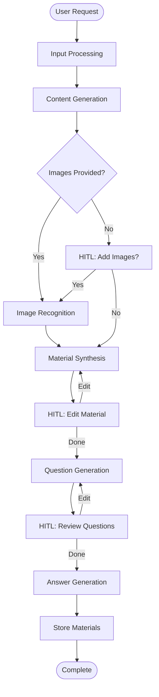
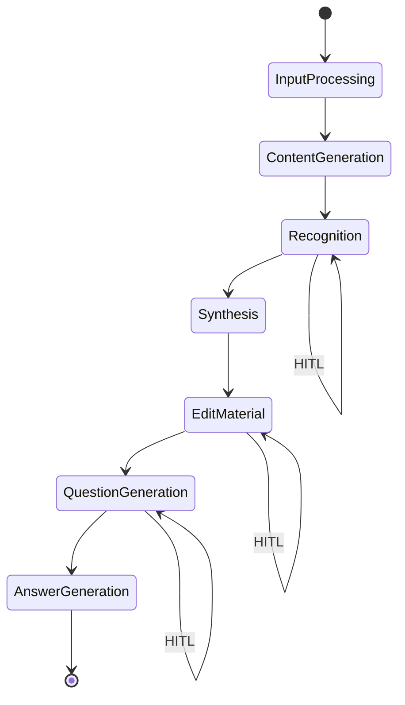

# Workflow Architecture

The Base Library Backend uses LangGraph to orchestrate a sophisticated content generation workflow. This document explains the workflow architecture, node implementations, and Human-in-the-Loop (HITL) interactions.

## Workflow Overview

The content generation workflow is implemented as a directed graph where each node represents a specific processing step. The workflow can pause for human interaction at designated HITL points, allowing for iterative refinement of generated content.



## Workflow Nodes

### 1. Input Processing Node

**Purpose**: Validates and processes incoming user requests

**Responsibilities**:
- Input validation and sanitization
- Security checks using SecurityGuard
- Topic extraction and categorization
- Request logging and monitoring

**Input**:
```json
{
  "thread_id": "optional-thread-id",
  "message": "Explain quantum mechanics for beginners",
  "image_paths": ["path/to/image1.jpg", "path/to/image2.jpg"]
}
```

**Output**:
```python
state.input_content = "processed and validated request"
state.topic = "quantum mechanics"
state.difficulty = "beginner"
state.image_paths = ["path/to/image1.jpg", "path/to/image2.jpg"]
```

**Security Features**:
- Prompt injection detection
- Content length validation
- Malicious input filtering
- Educational context validation

### 2. Content Generation Node

**Purpose**: Generates educational material using AI models

**Responsibilities**:
- AI model selection and configuration
- Prompt engineering and optimization
- Content structure and formatting
- Quality assessment and validation

**AI Model Configuration**:
```yaml
models:
  content_generation:
    provider: deepseek
    model_name: "deepseek-chat"
    temperature: 0.1
    max_tokens: 4000
    system_prompt: "You are an expert educational content creator..."
```

**Output**:
```python
state.generated_material = """
# Quantum Mechanics for Beginners

## Introduction
Quantum mechanics is a fundamental theory in physics...

## Key Concepts
1. Wave-particle duality
2. Uncertainty principle
3. Quantum superposition
...
"""
```

**Quality Metrics**:
- Content coherence and structure
- Educational value assessment
- Factual accuracy validation
- Readability analysis

### 3. Image Recognition Node (HITL)

**Purpose**: Processes uploaded images for text extraction and analysis

**Responsibilities**:
- OCR text extraction
- Image content analysis
- Text cleaning and formatting
- Integration with generated content

**HITL Behavior**:
- **With Images**: Automatic processing
- **Without Images**: Pauses for user input

**HITL Prompt**:
```
📸 For improved material quality, you can add notes or images.

Options:
• Upload photos of notes or insert text
• Write 'skip' to continue
```

**Image Processing Pipeline**:
1. Image validation and preprocessing
2. OCR text extraction using Vision API
3. Text cleaning and formatting
4. Content integration planning

**Output**:
```python
state.recognized_notes = """
Extracted text from images:
- Key concepts from handwritten notes
- Diagrams and formulas
- Additional context and examples
"""
```

### 4. Material Synthesis Node

**Purpose**: Combines generated content with recognized text

**Responsibilities**:
- Content integration and merging
- Structure optimization
- Coherence improvement
- Final formatting

**Synthesis Process**:
1. Analyze generated material structure
2. Identify integration points for recognized text
3. Merge content while maintaining coherence
4. Optimize formatting and presentation

**Output**:
```python
state.synthesized_material = """
# Quantum Mechanics for Beginners

## Introduction
Quantum mechanics is a fundamental theory in physics...

## Key Concepts from Your Notes
Based on your notes, here are the essential concepts:
1. Wave-particle duality
2. Uncertainty principle
...
"""
```

### 5. Edit Material Node (HITL)

**Purpose**: Interactive content refinement with user feedback

**Responsibilities**:
- Content analysis and improvement suggestions
- User feedback processing
- Iterative refinement
- Quality enhancement

**HITL Behavior**:
- Analyzes current material
- Suggests improvements
- Waits for user feedback
- Implements requested changes

**HITL Prompt**:
```
Would you like to modify the material?

Current content covers:
- Introduction to quantum mechanics
- Basic concepts and principles
- Simple examples and analogies

Suggestions for improvement:
• Add more examples
• Include practice problems
• Simplify complex explanations
• Add visual diagrams

Please describe your desired changes or write 'done' to continue.
```

**Iterative Process**:
1. **Analysis**: Review current material
2. **Suggestion**: Propose improvements
3. **Feedback**: Collect user input
4. **Implementation**: Apply changes
5. **Validation**: Ensure quality
6. **Repeat**: Continue until satisfied

### 6. Question Generation Node (HITL)

**Purpose**: Creates assessment questions based on the material

**Responsibilities**:
- Question type selection
- Difficulty level adjustment
- Content coverage analysis
- Question quality validation

**HITL Behavior**:
- Generates initial question set
- Presents questions for review
- Allows modification and refinement
- Validates question quality

**HITL Prompt**:
```
Here are the assessment questions:

1. What is wave-particle duality in quantum mechanics?
2. Explain Heisenberg's uncertainty principle with an example.
3. How does quantum superposition differ from classical physics?

Would you like to modify these questions?
• Add more questions
• Change difficulty level
• Focus on specific topics
• Write 'approved' to continue
```

**Question Types**:
- **Multiple Choice**: For concept testing
- **Short Answer**: For explanation skills
- **Problem Solving**: For application skills
- **Critical Thinking**: For analysis skills

### 7. Answer Generation Node

**Purpose**: Provides comprehensive answers to generated questions

**Responsibilities**:
- Detailed answer creation
- Step-by-step explanations
- Example provision
- Reference integration

**Parallel Processing**:
- Generates answers for all questions simultaneously
- Optimizes response time
- Maintains answer quality
- Ensures consistency

**Output**:
```python
state.questions_and_answers = [
    {
        "question": "What is wave-particle duality?",
        "answer": "Wave-particle duality is a fundamental concept...",
        "explanation": "This concept was first proposed by...",
        "examples": ["Double-slit experiment", "Photoelectric effect"]
    },
    # ... more Q&A pairs
]
```

## Human-in-the-Loop (HITL) System

### HITL Configuration

The HITL system can be configured per thread to control interaction points:

```json
{
  "recognition_handwritten": true,
  "edit_material": true,
  "generating_questions": true
}
```

### HITL API Endpoints

- `GET /api/hitl/{thread_id}` - Get current HITL configuration
- `PATCH /api/hitl/{thread_id}/node/{node_name}` - Update specific node
- `POST /api/hitl/{thread_id}/reset` - Reset to default configuration
- `POST /api/hitl/{thread_id}/bulk` - Bulk configuration update

### HITL Interaction Flow

1. **Workflow Pause**: Node reaches HITL point
2. **State Preservation**: Current state saved to database
3. **User Notification**: Frontend receives HITL prompt
4. **User Interaction**: User provides input or makes choices
5. **Workflow Resume**: Processing continues with user input
6. **State Update**: New state incorporates user feedback

### HITL Best Practices

- **Clear Instructions**: Provide specific, actionable prompts
- **Progress Indication**: Show current workflow position
- **Undo Capability**: Allow users to revert changes
- **Timeout Handling**: Graceful handling of user inactivity
- **Context Preservation**: Maintain conversation context

## State Management

### State Structure

```python
class WorkflowState:
    # Input data
    input_content: str
    image_paths: List[str]
    thread_id: str
    session_id: str
    
    # Generated content
    generated_material: str
    recognized_notes: str
    synthesized_material: str
    questions: List[str]
    questions_and_answers: List[Dict]
    
    # Workflow control
    current_node: str
    edit_count: int
    hitl_config: Dict
    
    # Metadata
    created_at: datetime
    updated_at: datetime
    user_id: str
```

### State Persistence

- **Database Storage**: PostgreSQL for persistent state
- **Checkpointing**: Regular state saves during workflow
- **Recovery**: Automatic recovery from last checkpoint
- **Cleanup**: Automatic cleanup of completed workflows

### State Transitions



## Error Handling

### Error Types

1. **Input Validation Errors**: Invalid or malicious input
2. **AI Service Errors**: Model failures or rate limits
3. **Processing Errors**: Workflow execution failures
4. **Storage Errors**: Database or file system issues
5. **Network Errors**: Service communication failures

### Error Recovery

- **Retry Logic**: Automatic retry for transient errors
- **Fallback Strategies**: Alternative processing paths
- **Graceful Degradation**: Partial functionality maintenance
- **User Notification**: Clear error messages and guidance

### Error Monitoring

- **Error Tracking**: Comprehensive error logging
- **Alert System**: Real-time error notifications
- **Metrics Collection**: Error rate and pattern analysis
- **Performance Impact**: Error effect on system performance

## Performance Optimization

### Workflow Optimization

- **Parallel Processing**: Simultaneous answer generation
- **Caching**: Frequently used data caching
- **Lazy Loading**: On-demand resource loading
- **Batch Processing**: Multiple requests processing

### Resource Management

- **Connection Pooling**: Database connection optimization
- **Memory Management**: Efficient memory usage
- **CPU Optimization**: Workload distribution
- **I/O Optimization**: Efficient file and network operations

## Next Steps

- [Security Architecture](./security.md) - Security implementation details
- [core Service](../services/core.md) - Service-specific documentation
