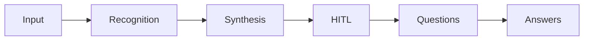
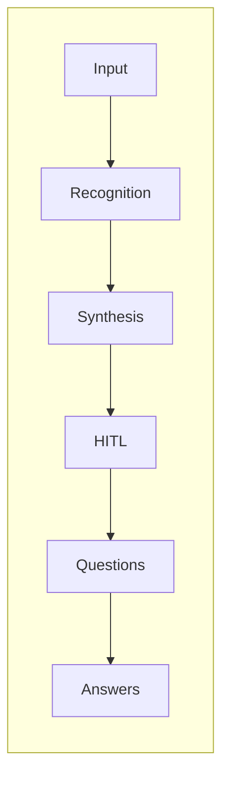
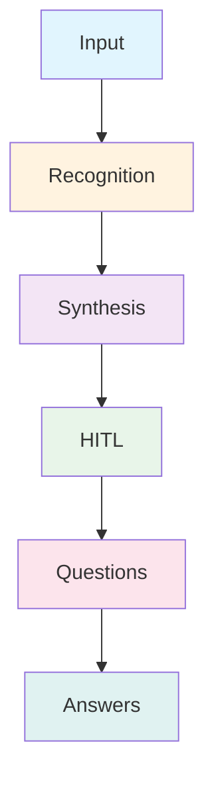

# Base Library — Workflow (Mermaid)

## Linear flow

```mermaid
flowchart LR
    A[Input] --> B[Recognition]
    B --> C[Synthesis]
    C --> D[HITL]
    D --> E[Questions]
    E --> F[Answers]
```

## Version with labels (left to right)

```mermaid
flowchart LR
    subgraph pipeline[" "]
        A["Input"]
        B["Recognition"]
        C["Synthesis"]
        D["HITL"]
        E["Questions"]
        F["Answers"]
    end
    A --> B --> C --> D --> E --> F
```

## Vertical flow (for slides)

```mermaid
flowchart TD
    A[Input] --> B[Recognition]
    B --> C[Synthesis]
    C --> D[HITL]
    D --> E[Questions]
    E --> F[Answers]
    
    style A fill:#e1f5fe
    style B fill:#fff3e0
    style C fill:#f3e5f5
    style D fill:#e8f5e9
    style E fill:#fce4ec
    style F fill:#e0f2f1
```

